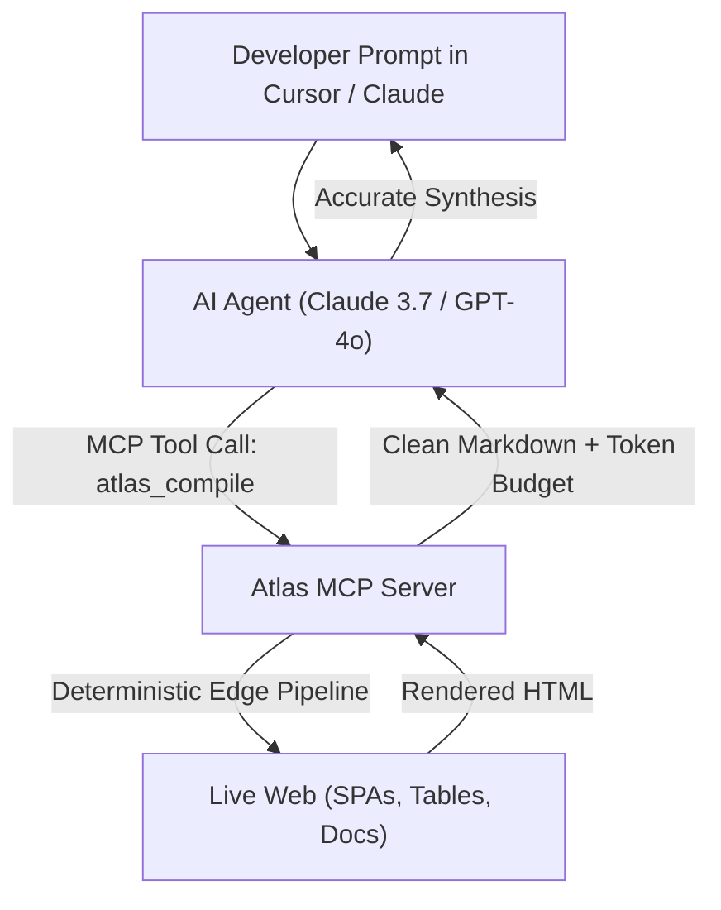

import McpInit from '/snippets/mcp-init-snippet.mdx';

> **Protocol Specification:** Model Context Protocol `2026-07-28`  
> **Server Package:** `@atlascompiler/mcp`  
> **Streamable HTTP Endpoint:** `https://api.atlas-compiler.com/mcp`

The **Atlas Model Context Protocol (MCP) server** gives LLMs, AI coding assistants (Cursor, Windsurf, Claude Desktop, VS Code), and autonomous agent frameworks deterministic, token-budgeted access to the live web.

Rather than feeding raw, noisy HTML into your model's context window—which burns token budgets and causes hallucinations—Atlas compiles dynamic web pages and single-page applications (SPAs) into clean, visual Markdown, tabular data, and structured AST graphs before delivering them to your agent.

---

## Why Atlas for AI Agents?



Traditional web scrapers and browser-use tools return messy raw DOM trees, cookies banners, and thousands of lines of JavaScript bundles. Atlas solves the core failure modes of agentic web access:

1. **Token Tax Elimination**: Atlas eliminates 60% to 80% of unnecessary markup, headers, navigation chrome, and tracking scripts, returning only semantically relevant Markdown.
2. **Context Window Protection**: Every Atlas MCP tool enforces character budgets (`max_output_chars`). If a document exceeds the budget, Atlas cleanly truncates the text and returns navigable `atlas://` resource links so the agent never overflows its context window.
3. **Table & Code Precision**: Complex multi-column tables are compiled into GitHub Flavored Markdown (GFM) pipe tables, and syntax-highlighted code fences preserve indentation and language tags.
4. **Zero Data Retention (ZDR)**: Atlas does not retain compiled web content or LLM prompts on disk. Workflows operating on sensitive corporate documentation remain strictly private.

---

## 1-Click Interactive Setup

Run the official interactive setup wizard in your terminal. It detects your installed AI editors, prompts for your Atlas API key, and automatically merges the server configuration into your local editor settings:

<McpInit />

The wizard supports the following options:

```bash
# Configure user-level settings globally across all projects
npx -y @atlascompiler/mcp init --global

# Configure project-level settings (.cursor/mcp.json or .vscode/mcp.json)
npx -y @atlascompiler/mcp init --project

# Verify currently resolved credentials and active configuration
npx -y @atlascompiler/mcp whoami
```

---

## Dual-Transport Architecture

Atlas MCP supports both standard transports specified by the Model Context Protocol:

```
                      ┌────────────────────────────────────────┐
                      │             AI Client / IDE            │
                      │  (Cursor, Claude Desktop, Windsurf)    │
                      └──────────────────┬─────────────────────┘
                                         │
                   ┌─────────────────────┴─────────────────────┐
                   │                                           │
         [Local Stdio Transport]                     [Streamable HTTP]
                   │                                           │
                   ▼                                           ▼
      ┌─────────────────────────┐               ┌─────────────────────────────┐
      │  @atlascompiler/mcp CLI  │               │ POST /mcp                   │
      │  (npx -y @atlas...)     │               │ https://api.atlas-compiler...│
      └────────────┬────────────┘               └──────────────┬──────────────┘
                   │                                           │
                   └─────────────────────┬─────────────────────┘
                                         │
                                         ▼
                            ┌────────────────────────┐
                            │    Atlas Edge Engine   │
                            └────────────────────────┘
```

| Transport | Primary Use Case | Connection Details |
| :--- | :--- | :--- |
| **stdio Transport** | Local desktop editors (Cursor, Claude Desktop, Windsurf, VS Code) | Run via `npx -y @atlascompiler/mcp` as a subprocess. Resolves credentials from `~/.atlas/credentials.json` or `ATLAS_API_KEY`. |
| **Streamable HTTP** | Cloud agents, serverless runners, LangGraph, CrewAI, Docker containers | Direct HTTP `POST https://api.atlas-compiler.com/mcp` with `Authorization: Bearer <API_KEY>`. Stateless and horizontally scalable. |

---

## Capabilities Support Matrix

Atlas implements the complete Model Context Protocol `2026-07-28` specification:

| Capability | Status | Description |
| :--- | :--- | :--- |
| **Tools** | **Supported** | 5 deterministic web extraction tools (`atlas_scrape`, `atlas_compile`, `atlas_map`, `atlas_crawl`, `atlas_batch_compile`). |
| **Resources** | **Supported** | Virtual `atlas://` URI scheme providing lazy access to compilation artifacts, full ASTs, and crawl pagination. |
| **Prompts** | **Supported** | Pre-built prompts for documentation synthesis, competitor analysis, and API reverse-engineering. |
| **OAuth 2.0 Protected Resource** | **Supported** | RFC 8414 resource server metadata exposed at `/.well-known/oauth-protected-resource`. |
| **Security & Host Validation** | **Enforced** | Strict Host and Origin header validation to protect against DNS rebinding attacks. |

---

## Native MCP Tools Summary

Atlas exposes 5 core tools designed specifically for LLM tool calling:

| Tool Name | Operation | When to Use |
| :--- | :--- | :--- |
| [`atlas_scrape`](/ai/tools-reference#atlas-scrape) | Fast-path single-page extraction | Quick retrieval of blogs, news articles, and simple documentation pages with minimal latency. |
| [`atlas_compile`](/ai/tools-reference#atlas-compile) | Visual layout compilation | Complex layouts, SPAs, pricing matrices, and technical documentation where table structure is critical. |
| [`atlas_map`](/ai/tools-reference#atlas-map) | High-speed URL topology mapping | Discovering site architecture, XML sitemaps, and documentation links without downloading page bodies. |
| [`atlas_crawl`](/ai/tools-reference#atlas-crawl) | Recursive multi-page spidering | Crawling multi-page documentation sections with include and exclude glob patterns. |
| [`atlas_batch_compile`](/ai/tools-reference#atlas-batch-compile) | Parallel multi-URL compilation | Compiling up to 20 URLs simultaneously with per-page budget enforcement and error isolation. |

---

## Agent Skill Installation

For agent environments that discover custom skills (such as Antigravity, Claude Code, or Cursor), you can install the official Atlas Agent Skill directly into your workspace:

```bash
# Install to project-level .agents/skills/atlas/SKILL.md
npx -y @atlascompiler/mcp skill

# Install globally to ~/.agents/skills/atlas/SKILL.md
npx -y @atlascompiler/mcp skill --global
```

---

## Next Steps

<CardGroup cols={2}>
  <Card title="Configure Cursor" icon="arrow-pointer" href="/ai/cursor">
    Set up Atlas MCP in Cursor Composer and Agent mode in under 60 seconds.
  </Card>
  <Card title="Configure Claude Desktop" icon="desktop" href="/ai/claude-desktop">
    Connect Atlas to Claude Desktop for deep web research and document analysis.
  </Card>
  <Card title="Configure Windsurf" icon="wind" href="/ai/windsurf">
    Integrate Atlas with Codeium Cascade for autonomous coding workflows.
  </Card>
  <Card title="MCP Tools Reference" icon="wrench" href="/ai/tools-reference">
    Detailed schemas, parameter definitions, and return types for all 5 Atlas tools.
  </Card>
</CardGroup>
