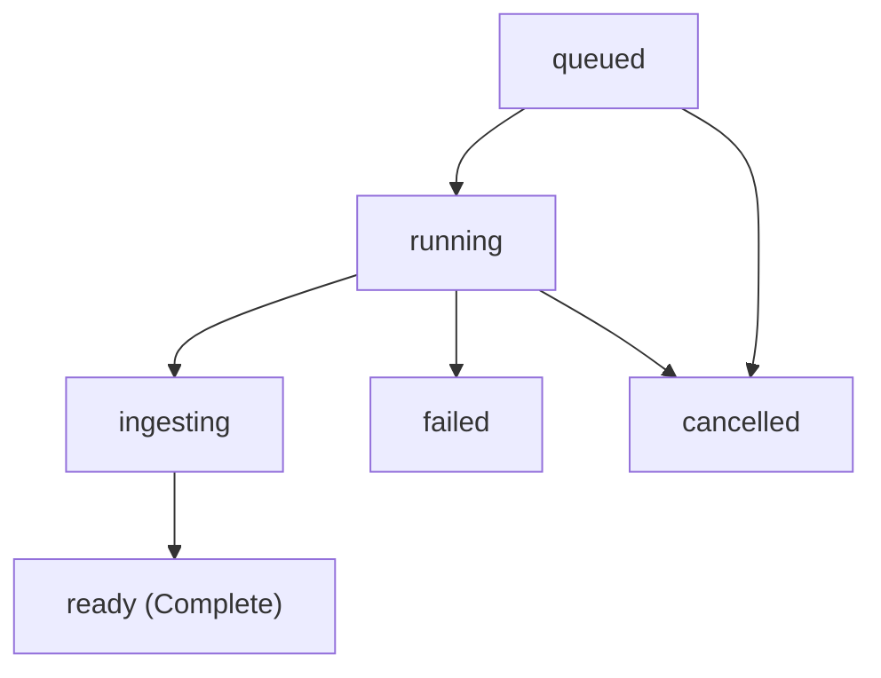

import AuthHeader from '/snippets/auth-header.mdx';

Inspect the current status and execution lifecycle of an asynchronous job (such as a crawl, batch compile, or deferred compilation).

---

## Authentication & Headers

<AuthHeader />

---

## Code Examples

<CodeGroup>
```bash cURL
curl -X GET https://api.atlas-compiler.com/v1/jobs/job_01j7abc123 \
  -H "Authorization: Bearer $ATLAS_API_KEY"
```

```typescript TypeScript
import { AtlasClient } from '@atlascompiler/sdk';

const atlas = new AtlasClient({ apiKey: process.env.ATLAS_API_KEY });

const res = await atlas.getJob('job_01j7abc123');
const job = res.value;

console.log('Status:', job.status);
if (job.progress) {
  console.log(`Progress: ${job.progress.completedItems} completed, ${job.progress.queuedItems} queued`);
}
```

```python Python
import os
from atlascompiler import AtlasClient

client = AtlasClient(api_key=os.environ["ATLAS_API_KEY"])

res = client.get_job("job_01j7abc123")
job = res.value

print(f"Status: {job['status']}")
if job.get("progress"):
    print(f"Progress: {job['progress']['completedItems']} completed, {job['progress']['queuedItems']} queued")
```

```go Go
package main

import (
	"context"
	"fmt"
	"os"

	"go.atlas-compiler.com/sdk"
)

func main() {
	client := atlas.New(os.Getenv("ATLAS_API_KEY"))

	job, _, err := client.GetJob(context.Background(), "job_01j7abc123")
	if err != nil {
		panic(err)
	}

	fmt.Printf("Status: %s\n", job.Status)
	if job.Progress != nil {
		fmt.Printf("Completed: %d, Queued: %d\n", job.Progress.CompletedItems, job.Progress.QueuedItems)
	}
}
```
</CodeGroup>

---

## Job Lifecycle States

Jobs transition through the following state machine:



| Status | Description |
| :--- | :--- |
| `queued` | Job has been admitted and is awaiting cluster execution slot. |
| `running` | Pages are actively being fetched, rendered, and compiled across edge nodes. |
| `ingesting` | All pages compiled; artifacts and indexes are finalizing. |
| `ready` | Terminal success state. Compiled pages are ready for retrieval via [`GET /v1/jobs/{jobId}/results`](/api-reference/job-results). |
| `failed` | Unrecoverable error occurred. Check [`GET /v1/jobs/{jobId}/errors`](/api-reference/job-errors). |
| `cancelled` | Execution was explicitly halted by a user cancellation request. |
