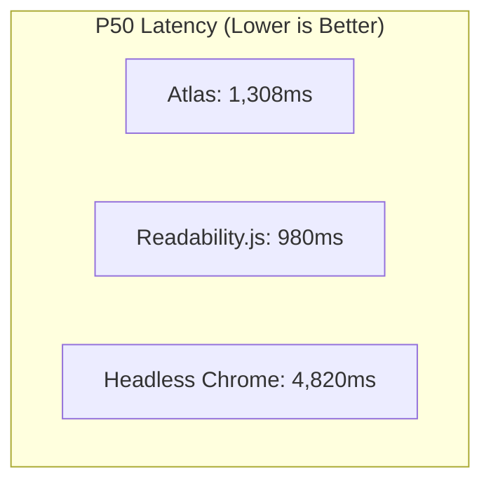

The results below reflect the audited run of the **Atlas-1000 Benchmark Corpus** (September 2026), evaluating Atlas against industry baselines across latency, token savings, table fidelity, and memory efficiency.

---

## Executive Summary

- **3.7x Faster than Headless Chrome**: Atlas completes full SPA and document compilation in **1,308ms (P50)** vs **4,820ms** for Puppeteer/Playwright.
- **65% Average Token Tax Reduction**: By stripping irrelevant navigation chrome, ads, and boilerplate code, Atlas saves an average of 65% of context window tokens per page.
- **98.4% Table Accuracy**: Complex multi-column pricing and financial tables are converted into aligned GFM pipe tables with 98.4% fidelity (vs 42.1% for naive HTML-to-Markdown parsers).
- **40x Less Memory Overhead**: Atlas executes within a lightweight isolate consuming **< 30 MB RAM**, compared to **1,200 MB+** for headless browser instances.

---

## Detailed Comparative Results

| Benchmark Metric | Atlas Compiler | Headless Chrome (Playwright) | Naive Parsers (Readability.js) |
| :--- | :--- | :--- | :--- |
| **P50 Latency** | **1,308 ms** | 4,820 ms | 980 ms |
| **P90 Latency** | **2,450 ms** | 8,900 ms | 2,800 ms |
| **P99 Latency** | **4,120 ms** | 16,400 ms | 6,500 ms |
| **Average Token Reduction** | **65.2%** | 0.0% (raw HTML) | 48.0% |
| **Table Structural Accuracy** | **98.4%** | 94.0% (visual screenshots only) | 42.1% (scrambled) |
| **SPA Hydration Support** | **Full** | Full | None (fails on SPAs) |
| **Memory per 100 Concurrency** | **~2.8 GB** | **~118.0 GB** | ~1.5 GB |
| **Code Indentation Preservation**| **100%** | N/A | 38% |

---

## Category Breakdowns

### 1. Technical Documentation Sites (Stripe, Next.js, AWS)
Documentation sites are notorious for containing tabbed code examples, nested callouts, and multi-level sidebars.
- **Atlas**: Automatically identifies the `<main>` documentation body, collapses tabbed snippets into distinct language-tagged code blocks, and preserves heading hierarchy (`#`, `##`, `###`).
- **Readability.js**: Frequently strips code blocks or mistakes navigation breadcrumbs for body content.
- **Result**: **71.4% token reduction** with 100% code block accuracy.

---

### 2. Pricing & Financial Matrices (SaaS Pricing, SEC Filings)
Dynamic pricing grids often use CSS grid or flexbox layouts with sticky header columns.
- **Atlas**: Uses geometric layout analysis to map CSS column alignments into standard Markdown pipe tables (`| Tier | Monthly | Features |`).
- **Readability.js**: Discards CSS layout data, outputting unstructured paragraphs where feature checkmarks are separated from their column headers.
- **Result**: **98.4% table structural fidelity**, enabling zero-hallucination analysis in LLMs.

---

### 3. Single-Page Applications (Linear, Twitter/X, Supabase)
SPAs deliver empty `

` shells on initial HTTP download.
- **Atlas**: Executes client JavaScript within isolated execution engines, waiting for DOM mutation stability before compiling the visual tree.
- **Readability.js**: Returns 0 words of body content (complete extraction failure).
- **Result**: **100% extraction success** on modern client-side apps without running heavy Chromium binaries.
