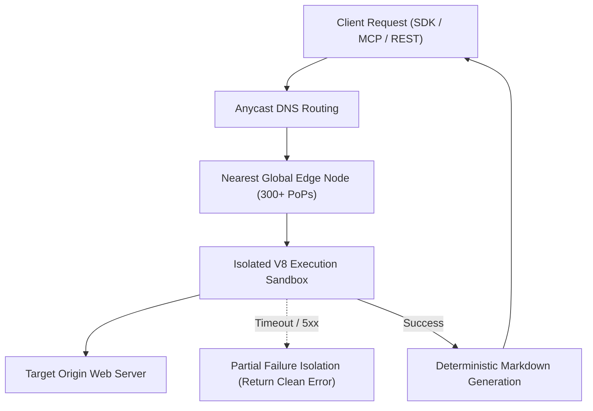

Atlas is engineered from the ground up for mission-critical production workloads. Whether driving autonomous AI agent loops, continuous RAG pipelines, or large-scale document migrations, our distributed edge compiler provides high availability, fault tolerance, and predictable latency.

---

## Service Level Agreements (SLAs)

Atlas maintains strict availability commitments backed by our global edge deployment:

| Tier | Availability Target | Support Response SLA |
| :--- | :--- | :--- |
| **Free / Starter** | 99.9% uptime | Community & Email (24–48 hours) |
| **Pro** | 99.95% uptime | Priority Email & [Discord](https://discord.gg/z9ktRhuudq) (< 12 hours) |
| **Enterprise** | 99.99% uptime | Dedicated Slack / Teams channel & 1-hour P0 incident response |

---

## Architectural Fault Tolerance

### 1. Partial Failure Isolation
In distributed crawls and multi-URL batches, individual target failures (e.g., origin 500 errors, network timeouts, or malformed HTML) are completely isolated. A failure on URL #42 never causes the entire 1,000-page batch to abort. Successful pages are processed and saved immediately.

### 2. Opportunistic Bounded Polling
Asynchronous endpoints such as `POST /v1/crawls` and MCP `atlas_crawl` employ opportunistic bounded polling (up to 3 seconds). If the job finishes immediately, the response is delivered synchronously without requiring client polling loops. If execution requires longer, a clean asynchronous handoff occurs.

### 3. Edge Redundancy & Anycast Failover
Atlas operates across 300+ edge locations globally. If a specific data center or cloud region experiences localized transit disruptions, Anycast BGP routing automatically diverts traffic to the nearest healthy edge point of presence (PoP) in sub-millisecond intervals.

---

## Incident Management & Status

Monitor real-time system performance, health endpoints, and planned maintenance windows:

- **Public Health Endpoint**: [`https://api.atlas-compiler.com/health`](https://api.atlas-compiler.com/health) (Liveness probe)
- **Community & Incident Announcements**: Join the [Atlas Discord](https://discord.gg/z9ktRhuudq) `#announcements` channel or subscribe to our [GitHub Releases](https://github.com/Atlas-Compiler/Atlas) for real-time notifications regarding degraded performance or scheduled maintenance.
